# Introduction To SQL
**A relational database is a collection of data items with pre-defined
relationships between them. These items are organized as a set of tables with
columns and rows. Tables are used to hold information about the objects to be
represented in the database.**
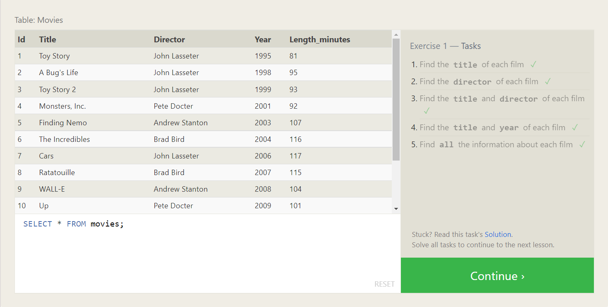
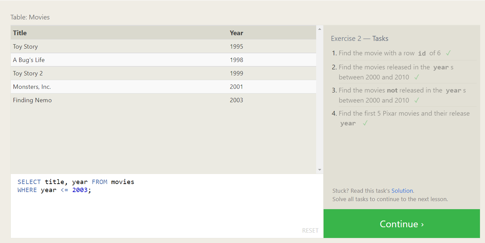
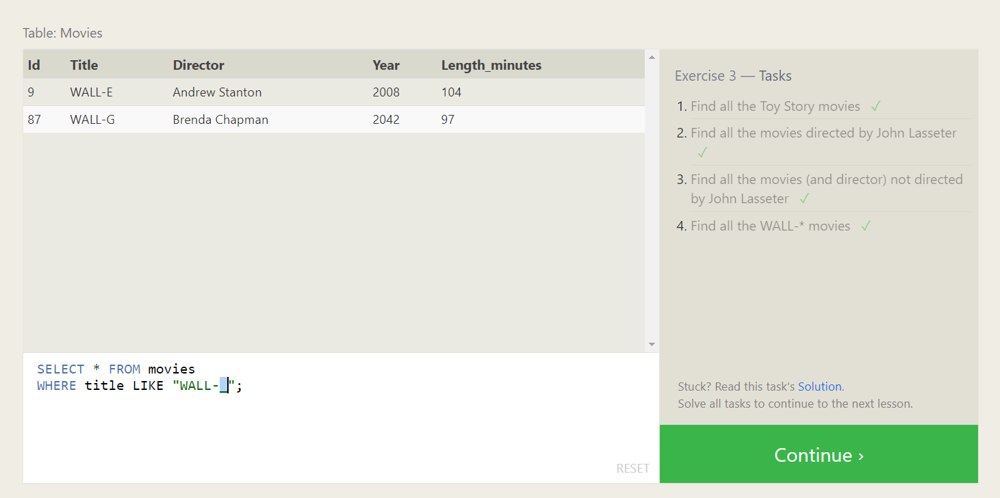
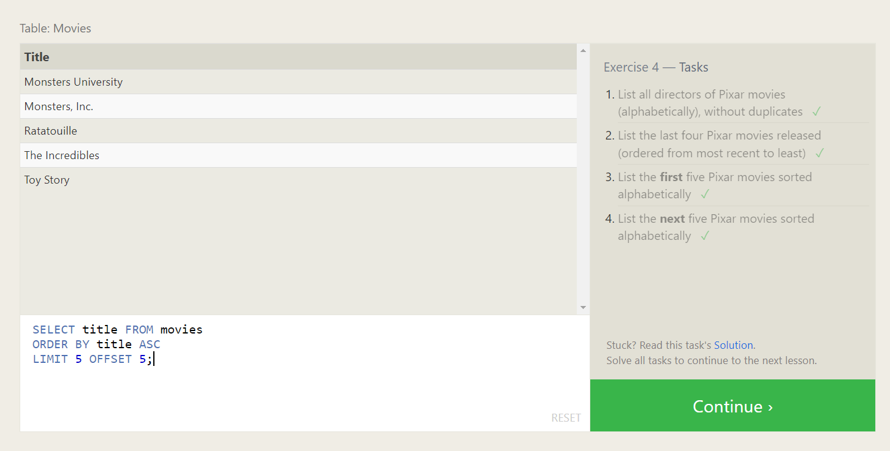
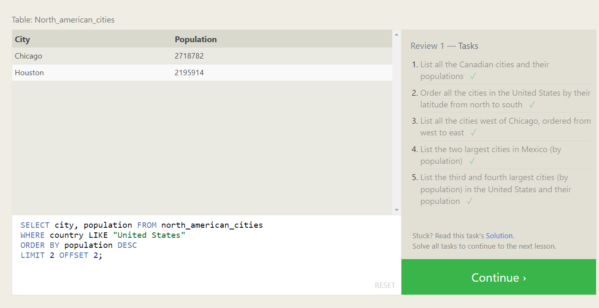
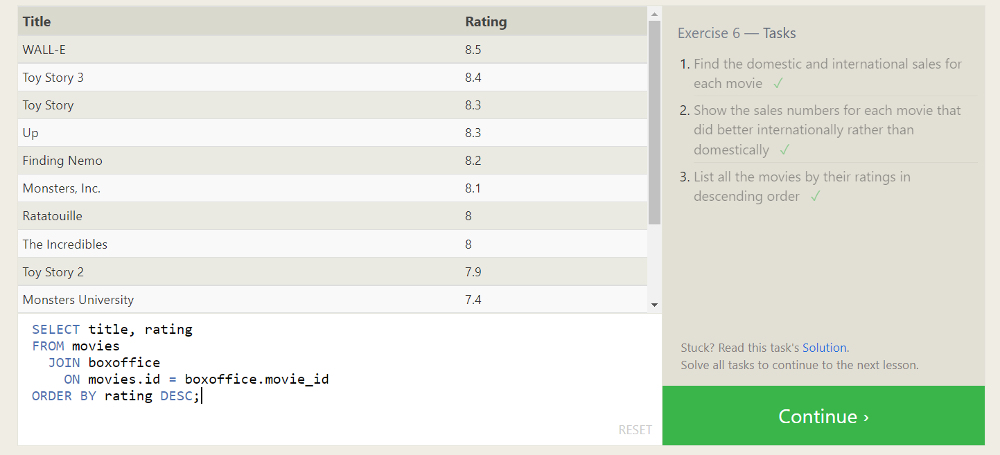
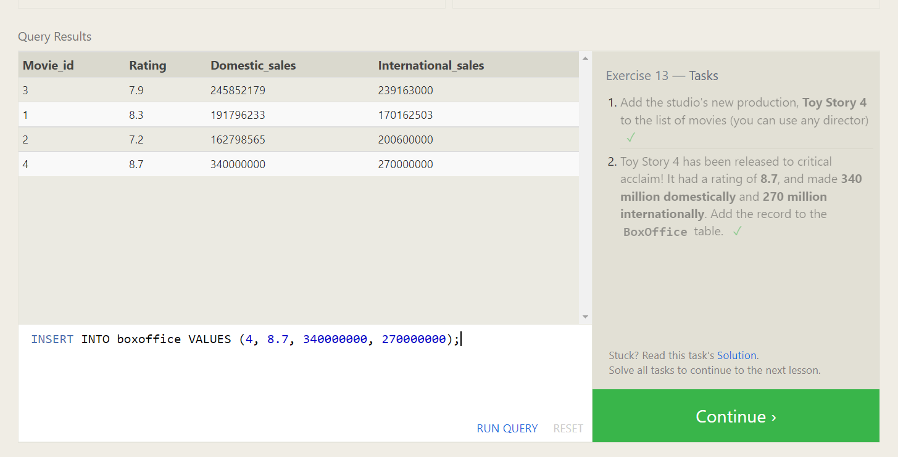
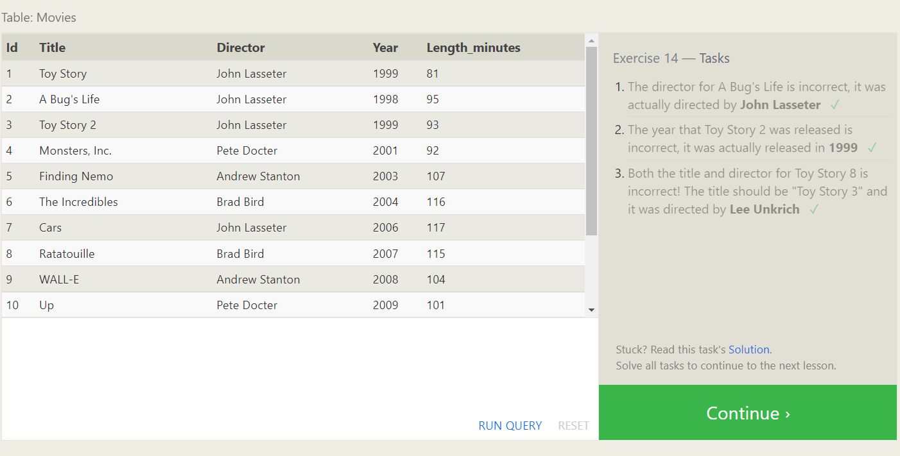
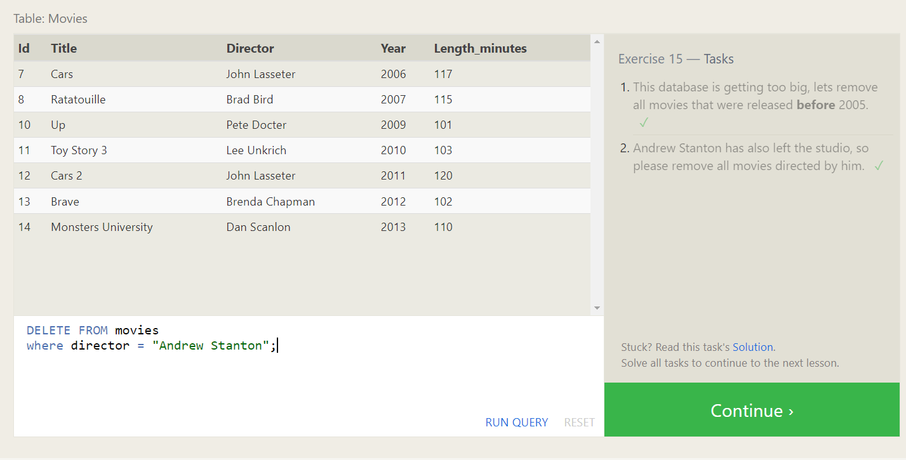
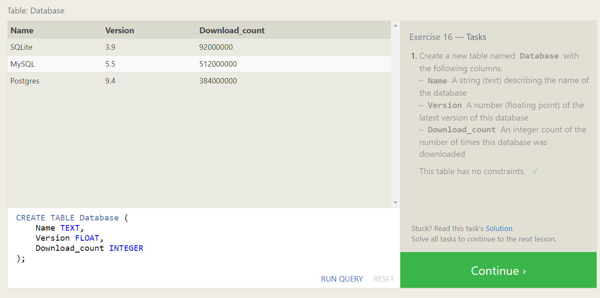
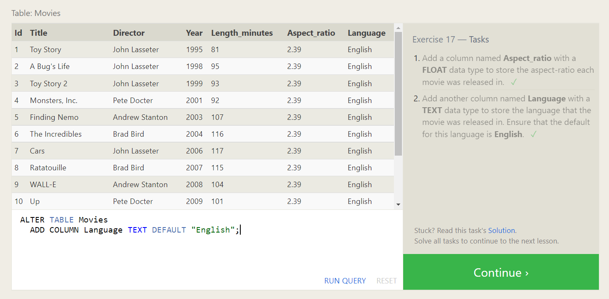
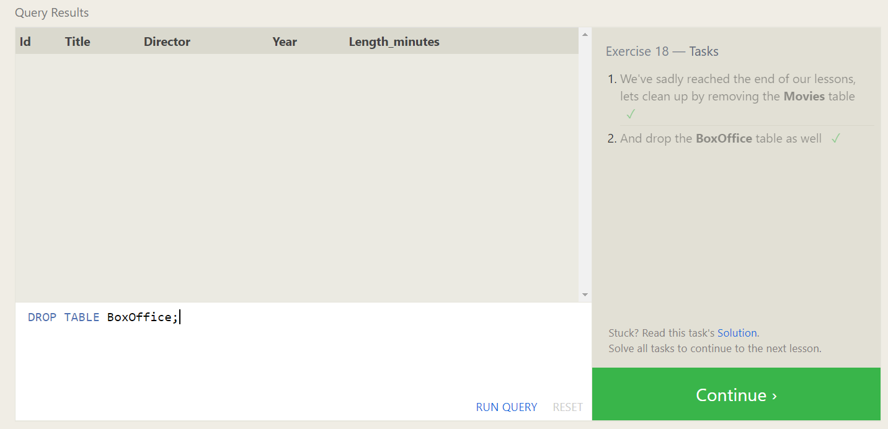